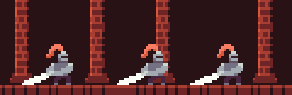

# 🎨 My Art Collection - Aseprite Creations

Welcome to my personal art repository! This is a curated collection of artwork that I have created, mostly using **Aseprite**, a pixel art tool. The art spans various styles and projects, including pixel art, animations, and more.

Feel free to explore and use the artwork (within the bounds of the license provided below).

## 🖼️ Showcase

Here are a few highlights from my collection. These represent some of my favorite pieces, ranging from pixel art characters to animated sprites.

### Pixel Art Characters

*Description: A ape with sunglasses*


*Description: A idle animation.*


*Description: A sword slash animation to learn how to give animations weight.*

---

Feel free to check out my games on [my itch page](nikkcc.itch.io) for more art and my games!

---

## 🖌️ Tools and Software

Most of the art here was made using:

- **[Aseprite](https://www.aseprite.org/)** - A popular pixel art editor with powerful features for creating sprites, animations, and more.
  
---

## 📂 Repository Structure

Here’s an overview of how the repository is structured:

```bash
📁 ART/
├── 📁 gamejams/ # the art i made for gamejams
│   ├── 📁 FishermanStorm/
│   ├── 📁 carsizer/
│   ├── 📁 rub/
│   └── 📁 zeusWrath/
├── 📁 me/
│   └── 🎨 *.png # me tying to learn art
├── 📁 pallets/
│   └── 🎨 *.png # Most of the pallets i used
├── 📁 profilepic/
│   └── 🎨 *.png # The APE
└── LICENSE
```
---

## 🎯 Projects & Themes

Game Characters: From classic RPG sprites to modern pixel-style characters.
Backgrounds: Cityscapes, nature, and various scenes in pixel form.
Icons: Small, detailed pixel icons for various purposes.
Animations: Sprite animations for characters and objects, including idle, walking, and attack cycles.

---

## 📖 How to Use

Clone the repository:
bash
Copy code
git clone https://github.com/your-username/my-art-collection.git
Open any .ase files in Aseprite or view the exported .png images for completed work.

---

## 🔧 Dependencies
Aseprite (for .ase file editing)
Optional: Image viewer for .png previews

---

# 📜 License
All artwork in this repository is licensed under the Creative Commons Attribution-NonCommercial 4.0 International (CC BY-NC 4.0) license.

You are free to:

Share, copy, and redistribute the material.
Adapt, remix, and transform the artwork.
Under the following terms:

Attribution: You must give appropriate credit.
NonCommercial: You may not use the artwork for commercial purposes.
Read more about the license here.

---

# 🤝 Contributing
This is a personal project, but I am open to suggestions! Feel free to submit issues for feedback or improvements.

---

# 🌟 Acknowledgments
Special thanks to the Aseprite community and pixel artists who inspired me.
Shoutout to open-source projects and pixel art tutorials that helped me along the way

---

Thank you for stopping by and exploring my art collection! 🎉
